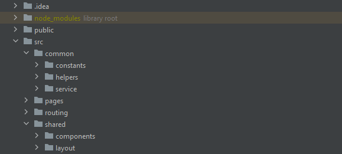
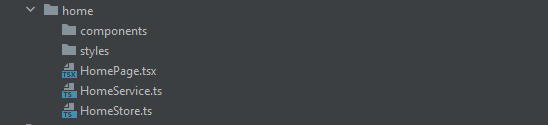

### `npm start`

Chạy ứng dụng dưới local.
Mở http://localhost:3000 để xem trong trình duyệt.

Trang sẽ tải lại nếu thực hiện chỉnh sửa.

### `npm run build`

Xây dựng ứng dụng cho production vào thư mục build.
Nó sẽ gói chính xác React trong chế độ production và tối ưu hóa bản dựng để có hiệu suất tốt nhất.

Bản dựng được nén lại và tên tệp bao gồm các hash.
Ứng dụng của bạn đã sẵn sàng để triển khai!

### `Quản lý state global`

Sử dụng mobx quản lý state

### `Quy cách đặt tên`

Tên folder, tên hàm, tên biến: đặt dạng camelCase. - VD: homePage. 
Tên component đặt dạng PascalCase. - VD: HomePage.

### `Cấu trúc thư mục`

- public: Chứa các file image, js, style dùng chung
- Trong src:
    - common: chưa các hàm dùng chung
        - constants: định nghĩa các biến dùng chung
        - helpers: hàm xử lí request đến server
        - service: lưu chữ localstorage, cookie
    - pages: chứa các pages tính năng
    - router: chứa các router của page
    - shared: Chứa các component dùng chung

### `Cấu trúc tính năng`

1. Tính năng sẽ gồm:
 - components: Chứa các components
 - styles: Chứa các file style css
 - HomePage: components chính sẽ có thêm Page đằng sau để phần biệt rõ
 - ProductService: components chưa api
 - ProductStore: components nơi xử lý lưu trữ dữ liệu, logic, hàm request đến server 
